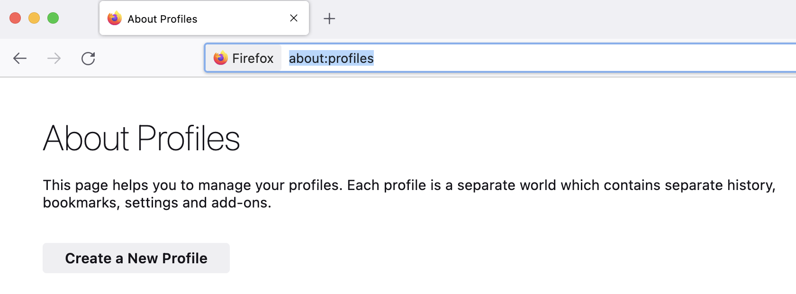
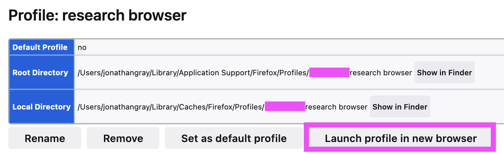
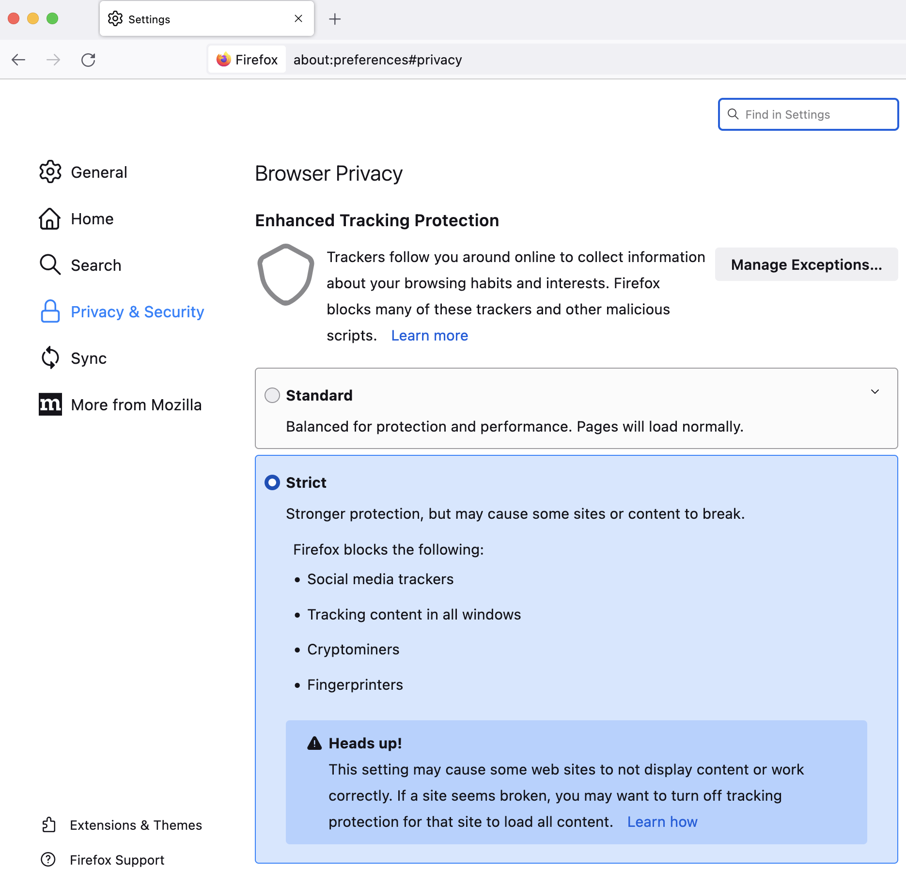
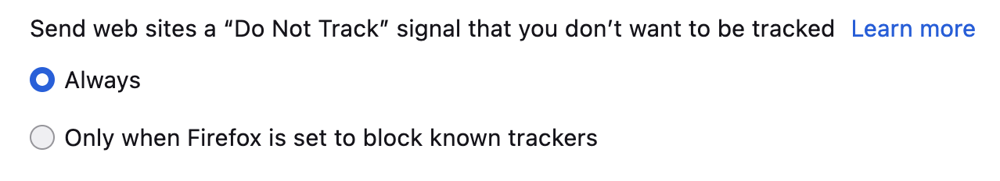
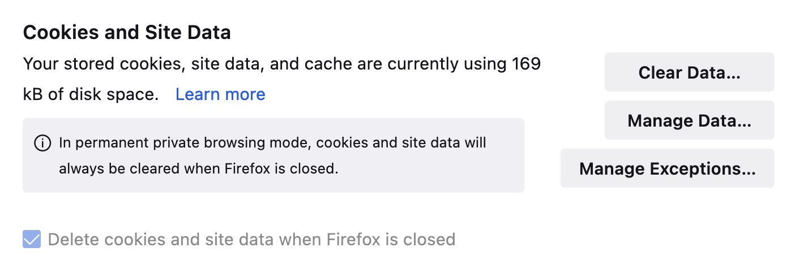
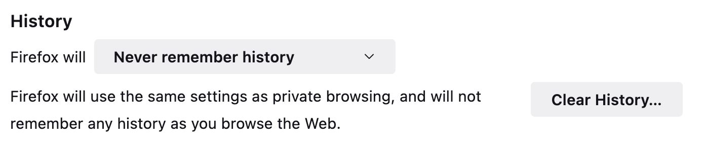

# 🖥✨ Setting up a research browser

*How to set up a research browser for digital methods research.*

Research browsers are often used in digital methods projects in order to gather materials from the web, search engines and platforms while mitigating personalisation effects.

As Richard Rogers writes in *Doing Digital Methods* (London: SAGE, 2019):

> By installing a separate instance of a browser (such as Firefox) as a ‘research browser’, the researcher prepares a clean slate, free of cookies and other engine entanglements such as history and preferences.

# 📃 Steps

The following steps are for setting up a research browser on a laptop or desktop (not a mobile or tablet device).

The main idea of these steps is to create a fresh profile and disable and minimise any preferences related to tracking and personalisation.

⚠️ *Note: You should make sure and use **only this browser profile for research** and do not attempt to sign into any websites or social media services.*

## 1. Download

*  Download the latest version of [Firefox](https://www.mozilla.org/en-GB/firefox/new/) Desktop.

*Depending on your browser and operating system, there may be slight differences between the steps below and what you see on your screen.*

## 2. Create new profile

* Type `about:profiles` into address bar.
* Click the button that says "**Create a New Profile**"

> 

* Click "Continue" in the popup and enter a name for your new research profile (e.g. "research browser", or whatever you'd like)
* Scroll down to the newly created profile and click the button that says "**Launch profile in new browser**".

> 

At this point a new browser should open up! 🎉

## 3. Set browser preferences

* Type `about:preferences#privacy` into the address bar.
* Under "*Enhanced Tracking Protection*", select "**Strict**" .

> 

* Under "*Send web sites a 'Do Not Track' signal"*, select "**Always**".

> 

* Under "Cookies and Site Data" click "**Clear Data**".

> 

<!-- commenting this out for now as zeeschuimer does not work as expected with this setting
* Under "History" select "**Never remember history**"
>  -->

* Under "Address Bar", deselect all suggestion options.

> 

## 4. Install DMI tools Firefox extension

* If you plan on using DMI tools, you can [install the Firefox extension](https://www.digitalmethods.net/Dmi/FirefoxToolBar) to make sure they work correctly.

# 🔗 Other links, readings and resources

* Digital Methods Initiative (2015) ["The research browser"](https://www.youtube.com/watch?v=bj65Xr9GkJM)
  * ⚠️ *note: some software settings in this video are no longer up to date...*
* Digital Methods Initiative (2018) ["Things Internet Researchers Should know About Search Engines"](https://www.digitalmethods.net/Dmi/ThingsInternetResearchersShouldKnowAboutGoogle)
* Rogers, R. (2013). *Digital Methods*. Cambridge, MA: MIT Press.
* Rogers, R. (2017). [Foundations of Digital Methods: Query Design](https://www.jstor.org/stable/j.ctt1v2xsqn.10#metadata_info_tab_contents). In M. T. Schafer & K. van Es (Eds.), *The Datafied Society: Studying Culture Through Data* (pp. 75–94). Amsterdam: Amsterdam University Press.
* Rogers, R. (2019). *Doing Digital Methods*. London: SAGE Publications.

# 🐙 Inspiration, acknowledgments and contributors

*This recipe documents longstanding practice of the [Digital Methods Initiative (DMI)](https://digitalmethods.net/) as mentioned in the readings above. It draws on documentation and teaching materials from the [DMI](https://digitalmethods.net/), [DensityDesign Lab](https://densitydesign.org/) and the [Department of Digital Humanities, King's College London](https://kcl.ac.uk/ddh).*
